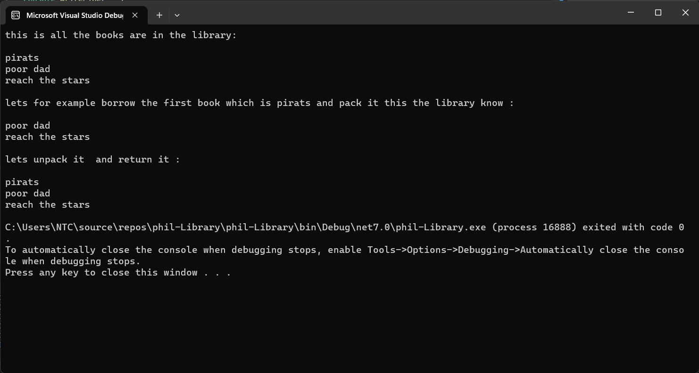

# phil-Library

## Desciption:

this is a simple library concept that is could phil library that you can add books to it and borrow and return books to it and also you have a pack pake that can pack the books that you borrowed to carry thiem and also to return them you can unpack thiem.
## Visual:

## Walk Through:
this is how the example of how it works where you have at the bigening this shows that the library that has 3 titles 
you can  borrow form this library and in the visual above you can see we borrowed the first book this will show that the library had removed the book that you have borrowed .
then we have returned it .

